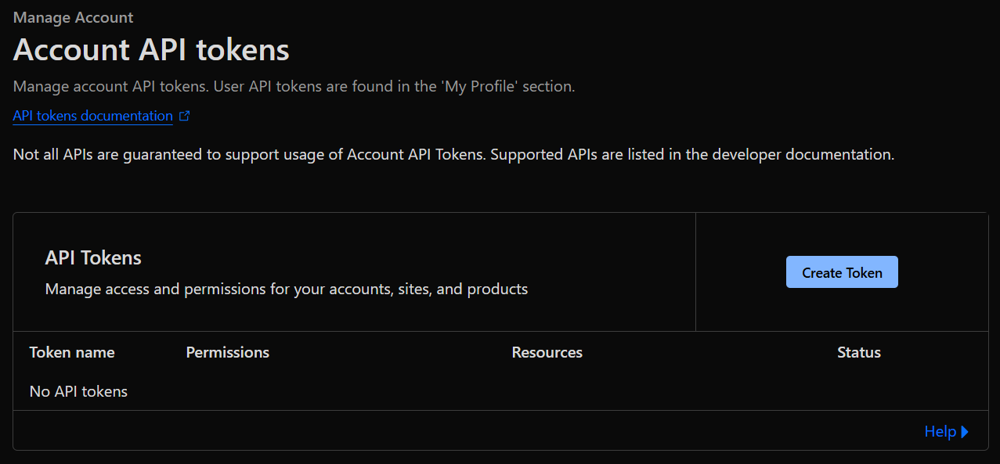
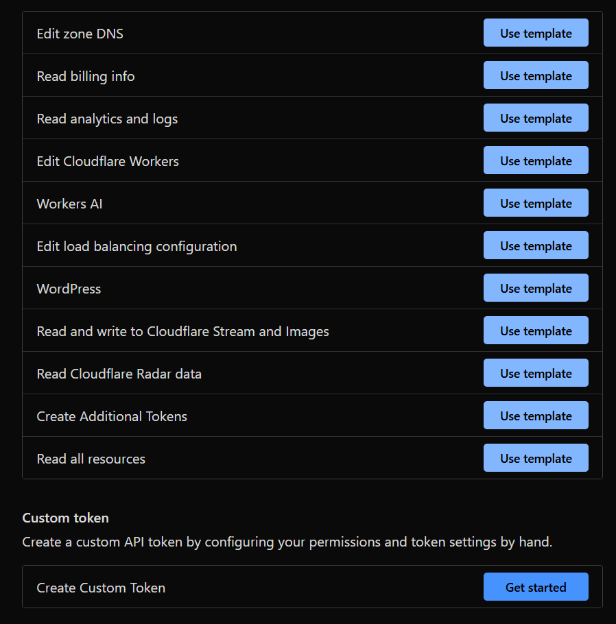
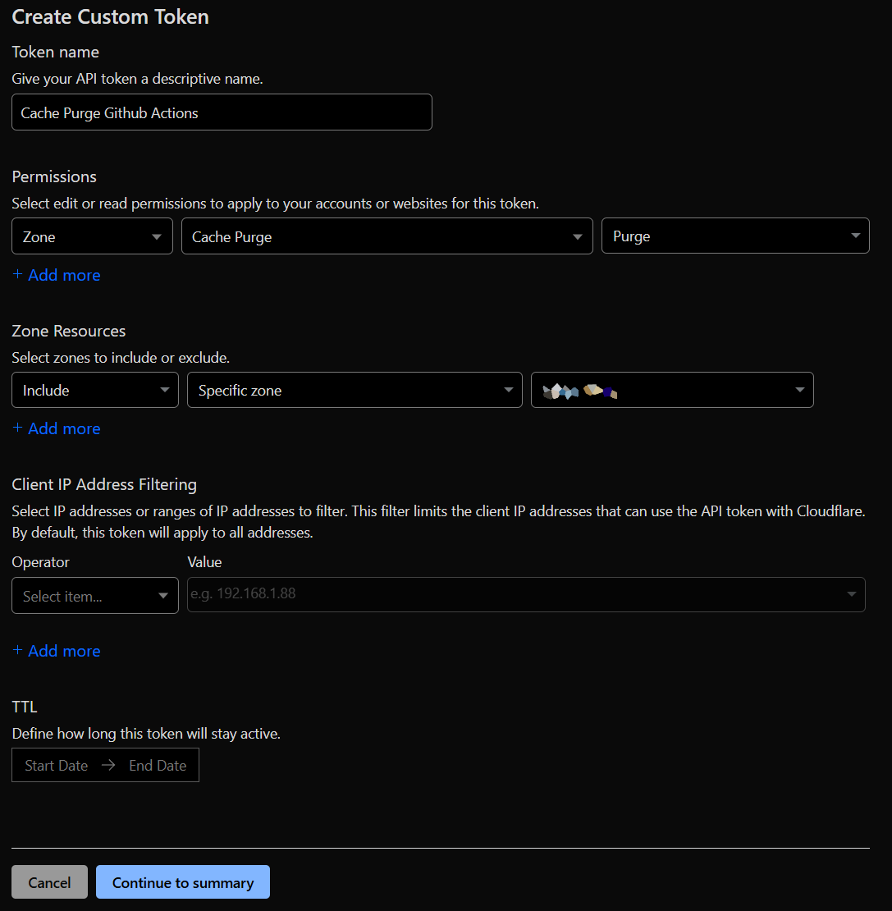
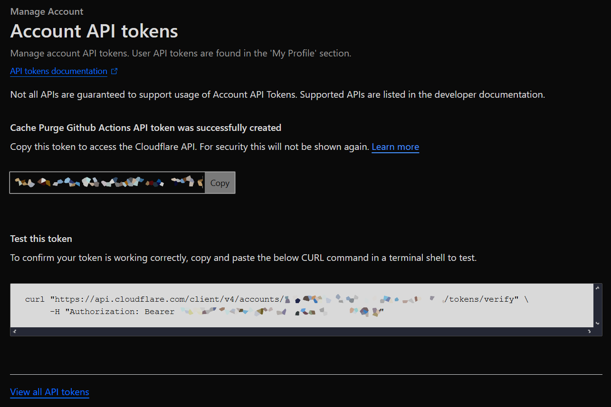
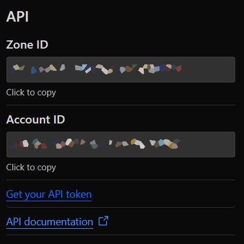
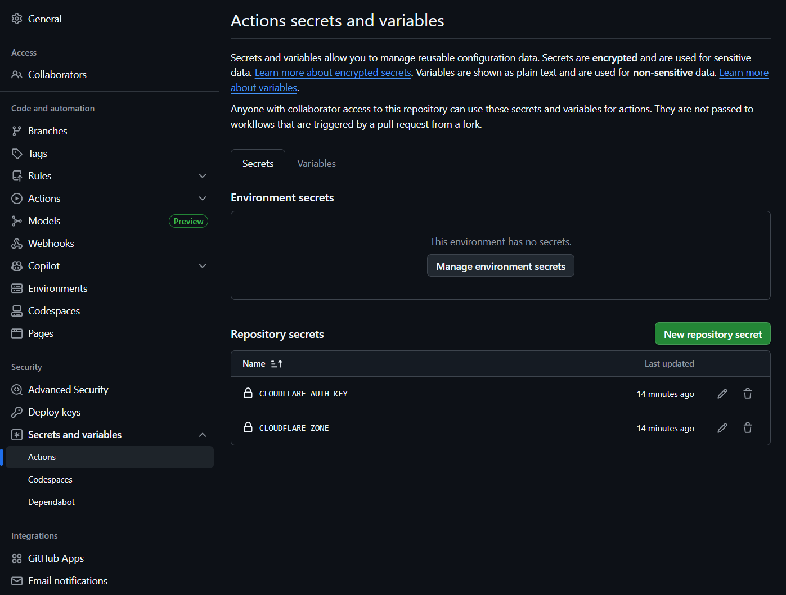

# Cloudflare Cache Purge Action

This unofficial Action uses Cloudflare's API to purge their
[cache](https://api.cloudflare.com/#zone-purge-all-files) of your site.
A Python 3.10+ interpreter is required (installed by default on GitHub-hosted runners).

As of April 1st, 2025, all purge methods are now available
for [all customers](https://blog.cloudflare.com/instant-purge-for-all/).

## Inputs

You can mix and match the various inputs however you want
(other than the zone and auth key). If you don't provide
`files` or `tags` or `hosts` or `prefixes`, then all files will be purged.

### `cf_zone` or `CLOUDFLARE_ZONE` environment variable

The zone ID of your Cloudflare site. Example:

```text
023e105f4ecef8ad9ca31a8372d0c353
```

### `cf_auth` or `CLOUDFLARE_AUTH_KEY` environment variable

The Cloudflare API key you've generated for your zone. Example:

```text
c2547eb745079dac9320b638f5e225cf483cc5cfdda41
```

### `files` (optional)

A space separated list of URLs to purge. Example:

```yml
files: https://nathanv.me/assets/images/profile.png https://nathanv.me/assets/images/favicons/apple-touch-icon.png
```

URL and header pairs are not supported in this Action.

The key `urls` is also accepted for backwards compatibility.

### `tags` (optional)

A space separated list of tags to purge. Example:

```yml
tags: some-tag another-tag
```

### `hosts` (optional)

A space separated list of hosts to purge. Example:

```yml
hosts: nathanv.me blog.nathanv.me
```

### `prefixes` (optional)

A space separated list of prefixes to purge. Example:

```yml
prefixes: nathanv.me/assets/ blog.nathanv.me/assets
```

### `python` (optional)

The path to the Python interpreter to use, in case you are using a self-hosted runner.
Defaults to `python`. Must be Python 3.10 or higher.

Example:

```yml
python: /usr/bin/python3.10
```


## Outputs

None

## Example Usages

```yml
- name: Purge cache
  uses: nathanvaughn/actions-cloudflare-purge@v4.0.0
  # preferred
  with:
      cf_zone: ${{ secrets.CLOUDFLARE_ZONE }}
      cf_auth: ${{ secrets.CLOUDFLARE_AUTH_KEY }}
```

```yml
- name: Purge cache
  uses: nathanvaughn/actions-cloudflare-purge@v4.0.0
  # legacy
  env:
      CLOUDFLARE_ZONE: ${{ secrets.CLOUDFLARE_ZONE }}
      CLOUDFLARE_AUTH_KEY: ${{ secrets.CLOUDFLARE_AUTH_KEY }}
```

```yml
- name: Purge cache
  uses: nathanvaughn/actions-cloudflare-purge@v4.0.0
  with:
      cf_zone: ${{ secrets.CLOUDFLARE_ZONE }}
      cf_auth: ${{ secrets.CLOUDFLARE_AUTH_KEY }}
      files: |
         https://nathanv.me/assets/images/profile.png
         https://nathanv.me/assets/images/favicons/apple-touch-icon.png
      tags: |
         some-tag
         another-tag
      hosts: |
         nathanv.me
         blog.nathanv.me
      prefixes: |
         nathanv.me/assets/
         blog.nathanv.me/assets
```

## Getting Cloudflare Info

1. First, go to your [user](https://dash.cloudflare.com/profile/api-tokens)
   or [account](https://dash.cloudflare.com/?to=/:account/api-tokens) API tokens
   page in your Cloudflare dashboard.



2. Click "Create Token", and scroll down to the bottom for "Create Custom Token".
   Click "Get started".



3. Fill out the form. Make sure to give the permission of
   "Zone" -> "Cache Purge" -> "Purge". Either select a specific zone, or all zones
   in the account.



4. Click "Continue to summary", then "Create Token".

5. Copy the value of the token.



6. To find the zone ID for your site, go to your dashboard for the zone,
   and look on the right-hand panel.



7. Follow GitHub's [documentation](https://help.github.com/en/articles/virtual-environments-for-github-actions#creating-and-using-secrets-encrypted-variables)
to add these values to your repository's secrets. It is under the "Settings" tab,
then "Secrets and variables" and "Actions".


