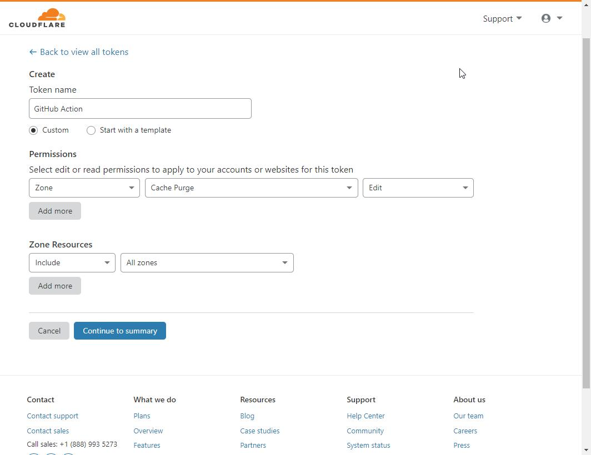
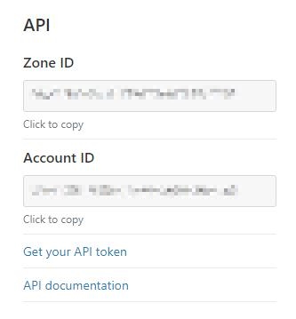

# Cloudflare Cache Purge Action
[](https://www.codacy.com/manual/NathanVaughn/actions-cloudflare-purge?utm_source=github.com&amp;utm_medium=referral&amp;utm_content=NathanVaughn/actions-cloudflare-purge&amp;utm_campaign=Badge_Grade)

This action uses Cloudflare's API to purge their
[entire cache](https://api.cloudflare.com/#zone-purge-all-files) of your site.

## Inputs

All inputs are pulled from environment variables for security and are required.
You can set these in the [secrets](https://help.github.com/en/articles/virtual-environments-for-github-actions#creating-and-using-secrets-encrypted-variables)
section of your repository information.

### `CLOUDFLARE_ZONE`

The zone ID of your Cloudflare site. Example:

```bash
023e105f4ecef8ad9ca31a8372d0c353
```

### `CLOUDFLARE_AUTH_KEY`

The Cloudflare API key you've generated for your zone. Example:

```bash
c2547eb745079dac9320b638f5e225cf483cc5cfdda41
```

## Outputs

None

## Example Usage

```yml
- name: Purge cache
  uses: nathanvaughn/actions-cloudflare-purge@master
  if: success()
  env:
    CLOUDFLARE_ZONE: ${{ secrets.CLOUDFLARE_ZONE }}
    CLOUDFLARE_AUTH_KEY: ${{ secrets.CLOUDFLARE_AUTH_KEY }}
```

## Getting Cloudflare Info

1.  First, go to the [API tokens page](https://dash.cloudflare.com/profile/api-tokens)
in your Cloudflare account.


2.  Click "Create Token", and fill out the form. Make sure to give the permission of
zone cache purge.


3.  Click "Continue to summary", then "Confirm".

4.  Copy the value of the token.


5.  To find the zone ID for your site, go to your dashboard for the site, and look on the
right-hand panel.


Follow GitHub's [documentation](https://help.github.com/en/articles/virtual-environments-for-github-actions#creating-and-using-secrets-encrypted-variables)
to add these values to your repository's secrets.


